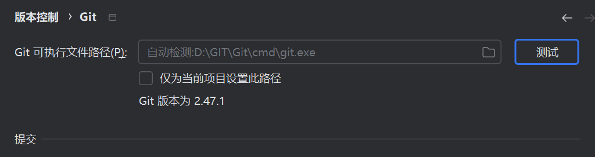
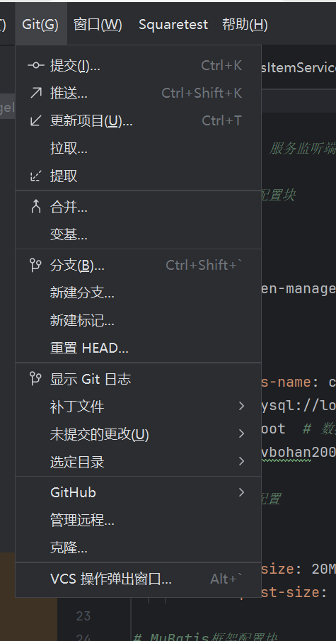
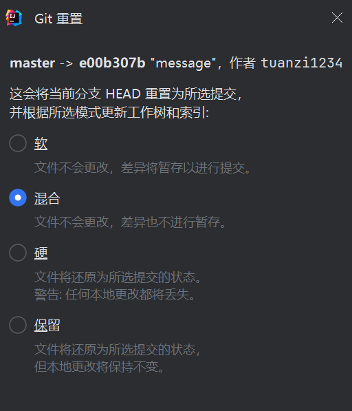

# GitHub Git 备忘单

Git 是一个开源的分布式版本控制系统，支持在本地进行 GitHub 操作。本备忘单总结了常用的 Git 命令行指令，供快速参考。

---

## 安装 Git
GitHub 提供桌面客户端，包含常见仓库操作的图形界面，并自动更新命令行版本的 Git。

- **GitHub for Windows**  
  https://windows.github.com
- **GitHub for Mac**  
  https://mac.github.com
- **Git 全平台版本**  
  http://git-scm.com

---

## 配置工具
为所有本地仓库配置用户信息

```bash
$ git config --global user.name "[姓名]"
# 设置提交时显示的姓名

$ git config --global user.email "[邮箱]"
# 设置提交时显示的邮箱

$ git config --global color.ui auto
# 启用命令行输出的颜色高亮

$ git config --list
# 显示所有配置信息

```
---
## 创建仓库
新建仓库或从现有 URL 克隆
```bash
$ git init [项目名]
# 创建指定名称的新本地仓库

$ git clone [URL]
# 下载项目及其完整版本历史
```
---
## 修改与提交
查看修改并提交变更
**1.版本库**：.git的隐藏文件夹就是版本库，存储了配置信息等。
**2.工作区**：包含.git文件夹的目录就是工作区，用于存放开发代码。
**3.暂存区**：.git文件夹中的index就是暂存区，用于保存临时修改文件的地方。 
**4.文件状态（status）**：
* untracked 未跟踪：未被纳入版本控制。
* tracked 已跟踪：被纳入版本控制。
  1）Unmodified 未修改
  2）Modified 已修改
  3）Staged 已暂存
```bash
$ git status
# 列出待提交的新增或修改文件

$ git diff
# 显示尚未暂存的文件差异

$ git add [文件]
# 将文件快照添加到暂存区（工作区 => 暂存区）

$ git diff --staged
# 显示暂存区与最新版本的差异

$ git reset [文件]
# 取消暂存文件，保留内容不变

$ git commit -m "[描述信息]"
# 将文件快照永久记录到版本历史（暂存区 => 版本库）

$ rd /s /q .git
# 删除版本库
```
---

## 分支管理
* **分支**：分支可以将工作从主线开发上分离，避免影响主线。同一个仓库可以有多个分支，分支间相互独立，互不干扰。

* **管理分支与合并操作：**

```bash
$ git branch
# 列出当前仓库的所有本地分支

$ git branch [分支名]
# 创建新分支

$ git checkout [分支名]
# 切换到指定分支并更新工作目录

$ git merge [分支名]
# 将指定分支的历史合并到当前分支

$ git branch -d [分支名]
# 删除指定分支
```
---
## 分支操作
```bash
$ git tag 
# 列出所有标签

$ git tag [标签名]
# 创建标签

$ git checkout -b [分支名] [标签名]
# 检出标签

$ git tag -d [标签名]
# 删除指定标签
```
---
## 文件重命名与删除
管理文件版本

```bash
$ git rm [文件]
# 从工作目录删除文件并暂存删除操作

$ git rm --cached [文件]
# 从版本控制移除文件，但保留本地文件

$ git mv [原文件名] [新文件名]
# 重命名文件并准备提交
```
---

## 查看历史
浏览项目版本演变

```bash
$ git log
# 显示当前分支的版本历史

$ git log --follow [文件]
# 显示文件的版本历史（包括重命名）

$ git diff [分支1]...[分支2]
# 显示两个分支的内容差异

$ git show [提交ID]
# 显示指定提交的元数据和内容变更
```
---

## 忽略文件
排除临时文件和目录

创建 .gitignore 文件（必须位于根目录下），写入匹配模式：
```
   target/
   .idea/
   *.iml
```
**说明：**
* 其中“target/”和".idea/"为文件目录，需在后面加“/”
* 其中*.iml为文件名，需在前面加“*”，用于匹配所有文件名
```bash
$ git ls-files --other --ignored --exclude-standard
# 列出项目中所有被忽略的文件
```
---

## 撤销操作(回退版本)
修正提交历史

```bash
$ git reset [提交ID（版本号）]
# 撤销指定提交之后的所有提交，保留本地修改

$ git reset --hard [提交ID（版本号）]
# 丢弃所有历史记录和更改，回到指定提交
```
---
## 暂存修改
临时保存未完成的工作

```bash
$ git stash
# 暂存所有已跟踪的修改文件

$ git stash pop
# 恢复最近一次暂存的文件

$ git stash list
# 列出所有暂存的变更集

$ git stash drop
# 丢弃最近一次暂存的变更集
```
---
## 同步变更
与远程仓库交互

```bash
$ git fetch [远程别名]
# 下载远程仓库的所有历史

$ git merge [远程别名]/[分支名]
# 将远程分支（指定分支）合并到当前本地分支

$ git push [远程别名] [分支名]
# 将本地分支提交推送到远程仓库

$ git pull [远程别名] [URL]
# 下载远程历史并合并变更（等同于 fetch + merge）

$ git remote add [远程别名] [URL]
# 添加远程仓库

$  git remote [远程别名]
# 列出所有远程仓库
```
---
## IDEA 使用Git
**1.在idea中配置git：**


**2.git在idea中的图形化界面：**


**3.git在idea中回退版本的界面：**


